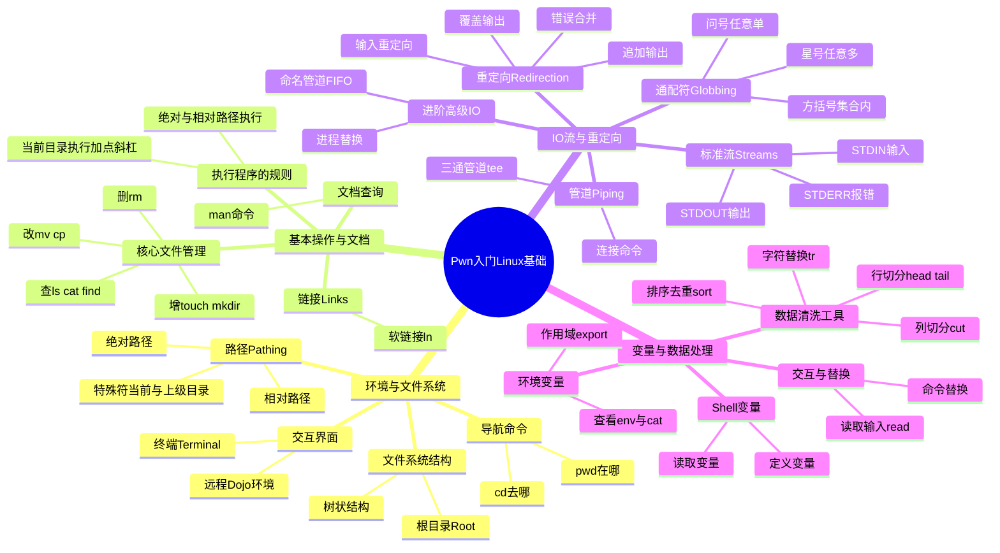

```mermaid
mindmap
  root((Pwn入门Linux基础))
    环境与文件系统
      交互界面
        终端Terminal
        远程Dojo环境
      文件系统结构
        根目录Root
        树状结构
      路径Pathing
        绝对路径
        相对路径
        特殊符当前与上级目录
      导航命令
        pwd在哪
        cd去哪
    基本操作与文档
      核心文件管理
        增touch mkdir
        删rm
        改mv cp
        查ls cat find
      执行程序的规则
        绝对与相对路径执行
        当前目录执行加点斜杠
      链接Links
        软链接ln
      文档查询
        man命令
    IO流与重定向
      通配符Globbing
        星号任意多
        问号任意单
        方括号集合内
      标准流Streams
        STDIN输入
        STDOUT输出
        STDERR报错
      重定向Redirection
        覆盖输出
        追加输出
        输入重定向
        错误合并
      管道Piping
        连接命令
        三通管道tee
      进阶高级IO
        命名管道FIFO
        进程替换
    变量与数据处理
      Shell变量
        定义变量
        读取变量
      环境变量
        作用域export
        查看env与cat
      交互与替换
        读取输入read
        命令替换
      数据清洗工具
        字符替换tr
        列切分cut
        行切分head tail
        排序去重sort
```